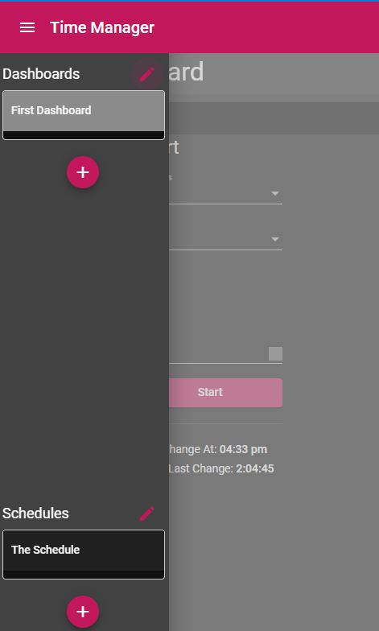
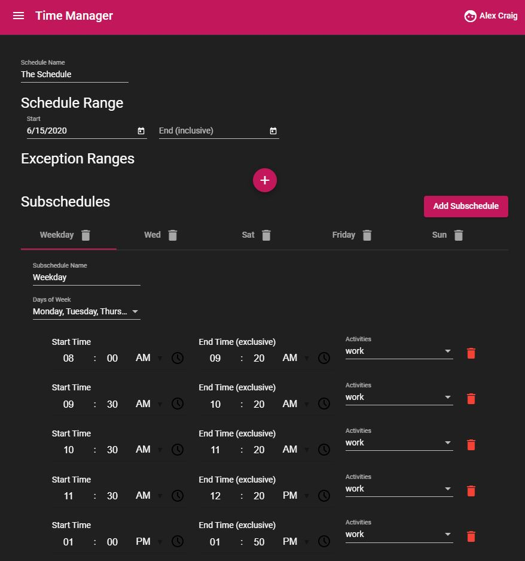
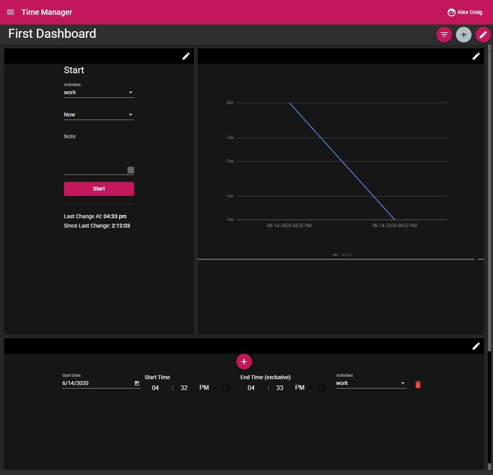
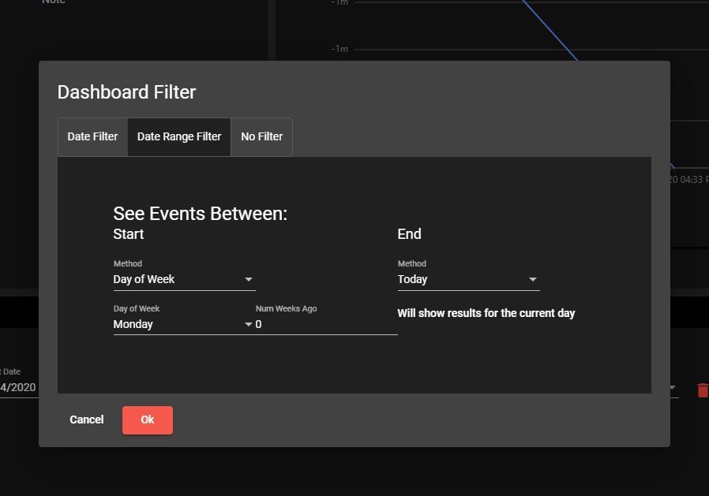

# TimeManager
An angular progressive web app that provides a dashboard with various widgets to help users manage their time.  Users can create their own schedules and record their activities to see if they're meeting their goals.

You can access [the deployed website](https://d2r09qybqzh17k.cloudfront.net). Note this is a WIP so there are currently several incomplete widgets and resizing issues.

## Schedules

Schedules can be created in the side nav.

Schedule List            |  Schedule Editor
:-------------------------:|:-------------------------:
  |  

Within your schedule, you can specify different routines based on the day of the week. In the event that you need a break from your routine, exceptions can be specified.

## Dashboard

Users can have multiple dashboards with widgets that can be created, deleted, and resized.  The dashboard below shows the following widgets:
*  Clock In & Out: Where users record their current activity
*  Line Graph: Indicates how well users are meeting their schedule by showing the number of minutes they are above or below their activity goals
*  Activity List: Users can modify their previous activity entries and view their notes

These widgets will update in real-time, allowing recent activity to be shared across multiple devices.

### Filters
 
Each dashboard can be filtered to only show schedules / activities within a certain time frame.

### TODO

* Improve mobile experience
* Add timers with notifications
* Improve error detection and allow for overlapping schedules
